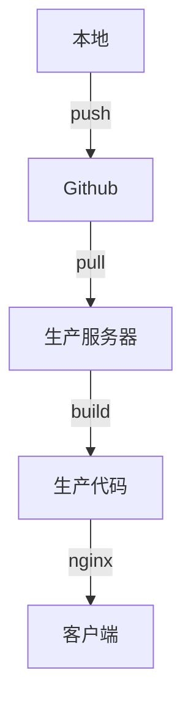
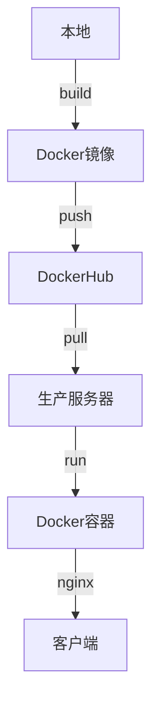
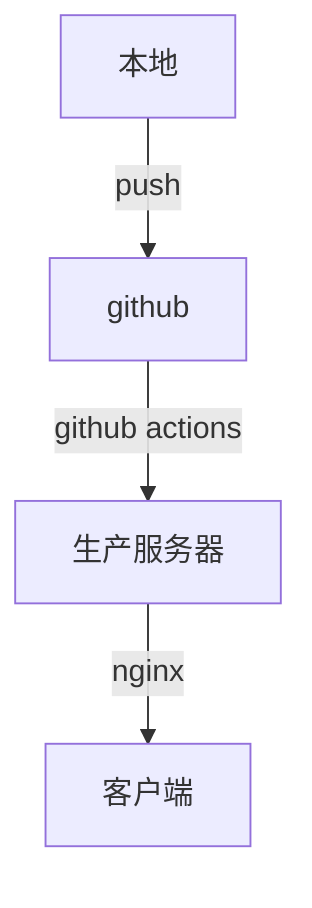
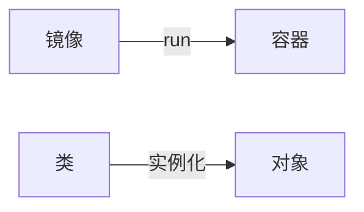

## 前言

之前上了一个腾讯云的轻量应用服务器用来部署一些前端项目，最初的思路是提交代码到github后，手动ssh到服务器上拉github代码，然后`npm run build`构建出来，项目访问则是配置`nginx`到项目下的`dist`目录实现，如果是SSR的项目，则通过`nginx`反向代理到对应的端口去实现。


大致流程如下：




这一流程后来遇到了4大痛点

1. 每个项目的部署流程不太一样，比如`koa`的项目是拉代码重新启动服务，`next`项目跑`next build`，普通的`react`项目跑`npm run build`，时间长了容易忘
2. 国内服务器访问github不稳定，经常连不上
3. 因node版本和一些环境差异导致的奇奇怪怪的错误
4. 迁移困难，所有目录的地址要对应上，也要重新拉一遍代码


而docker基本能够解决以上痛点

1. 通过`Dockerfile`把运行环境和构建流程固定下来，之后可以不再关心构建过程
2. 服务器通过DockerHub直接拉取镜像，目前无网络问题
3. 由于一个服务对应一个镜像，迁移的时候只需要拉取镜像实例化，然后配一下端口反代就可以了


大致流程如下：




而`github action`是github提供的持续集成服务，用于在提交代码的时候触发一些命令，具体可参考 [阮一峰的GitHub Actions 入门教程](https://www.baidu.com/link?url=Jrry1yE7RGewFEwhNqSquPxm51Gis7TNdLQsuqPrWRXfnqPfpDHQ7sUHUgUOJ4aPxibeXnyiej_PaNksaaIBqeSV_MbESi9YyFLaiLpRF-3PJ0gdf7u6DQk8r3Gvgch8&wd=&eqid=e307a46c00085717000000066215c97d)。


我通过配置实现了以下流程，当master分支提交的时候，github会进行以下操作

1. 用分支最新代码构建`docker`镜像，具体按照项目中的`Dockerfile`文件去执行
2. 将新构建的镜像发布到`DockerHub`
3. ssh到生产服务器拉取刚发布的Docker镜像，重新实例化





上了持续集成，后续可以继续加入一些操作，如代码校验、单元测试，我的hexo项目甚至写了一个node脚本把项目的markdown内容同步到数据库，而这些操作只需要通过`git push`触发，对于个人项目可以说是一劳永逸。

## Docker构建流程

Docker的核心概念包含镜像和容器这两个概念，他们的关系可以类比为类和对象



### 构建镜像

可以通过Dockerfile来定义构建镜像和实例化的细节，这里以`nextjs`的项目为例

```dockerfile
# Install dependencies only when needed
FROM node:14-alpine AS deps
# Check https://github.com/nodejs/docker-node/tree/b4117f9333da4138b03a546ec926ef50a31506c3#nodealpine to understand why libc6-compat might be needed.
RUN apk add --no-cache libc6-compat
WORKDIR /kevinlau-cn
COPY package.json yarn.lock ./
RUN yarn config set registry https://registry.npm.taobao.org/
RUN yarn install --frozen-lockfile

# Rebuild the source code only when needed
FROM node:14-alpine AS builder
WORKDIR /kevinlau-cn
COPY . .
COPY --from=deps /kevinlau-cn/node_modules ./node_modules
RUN npx browserslist --update-db
RUN yarn build

# Production image, copy all the files and run next
FROM node:14-alpine AS runner
WORKDIR /kevinlau-cn

ENV NODE_ENV production

# You only need to copy next.config.js if you are NOT using the default configuration
# COPY --from=builder /kevinlau-cn/next.config.js ./
COPY --from=builder /kevinlau-cn/public ./public
COPY --from=builder /kevinlau-cn/.next ./.next
COPY --from=builder /kevinlau-cn/node_modules ./node_modules

RUN addgroup -g 1001 -S nodejs
RUN adduser -S nextjs -u 1001
RUN chown -R nextjs:nodejs /kevinlau-cn/.next
USER nextjs

EXPOSE 3000

# Next.js collects completely anonymous telemetry data about general usage.
# Learn more here: https://nextjs.org/telemetry
# Uncomment the following line in case you want to disable telemetry.
# RUN npx next telemetry disable

CMD ["node_modules/.bin/next", "start"]
```

在项目目录下运行

```shell
docker build -t kevinlau/next-blog .
```

其中`-t`指定了镜像名称，运行后会按照`Dockerfile`的顺序逐行执行

构建完成后运行

```shell
docker image ls
```

可以看到刚才构建好的镜像


### 实例化容器

运行以下命令

```shell
docker run -d --name next-blog-container -p 8080:3000 -v /Users/kevinlau/config:/app/config kevinlau/next-blog
```

`-d`: 让容器后台运行

`--name`: 容器命名

`-p`: 将容器内部使用的网络端口映射到主机上

`-v`: 将主机目录映射到文件上

这样就可以在主机的http://localhost:8080端口访问到服务


### 上传到DockerHub

访问[https://hub.docker.com/](https://link.zhihu.com/?target=https%3A//hub.docker.com/)，如果没有账号，需要先注册一个。

利用命令docker login登录DockerHub，输入用户名、密码即可登录成功：

```shell
docker login
```

将本地的镜像推送到DockerHub上，这里的kevinlau要和登录时的username一致

```shell
docker push kevinlau/next-blog
```

在别的机子可以下载到该镜像

```
docker pull kevinlau/next-blog
```

 然后运行该镜像生成容器


## Github Actions自动化部署

`github actions`可以在项目目录下创建`.github/workflows/deploy.yml`，也可以直接在网页上Actions一栏操作，github提供了很多第三方编写好的流程，也可以自己写一套

这里直接放两个例子

### next项目（客户端）

这里的`secrets`相关字段涉及到`dockerhub`账号密码和服务器秘钥，需要自己到仓库`settings`下进行设置

```yaml
name: Publish Docker image

on:
  push:
    branches:
      - master
jobs:
  push_to_registry:
    name: Push Docker image to Docker Hub
    runs-on: ubuntu-latest
    steps:
  
      # checkout
      - name: Check out the repo
        uses: actions/checkout@v2
      
      # build
      - name: Build the Docker image
        run: docker build . --file Dockerfile --tag kevin031/blog-nextjs:latest

      # login
      - name: Log in to Docker Hub
        uses: docker/login-action@v1
        with:
          username: ${{ secrets.DOCKER_USERNAME }}
          password: ${{ secrets.DOCKER_PASSWORD }}

      # push to docker hub
      - name: Push to Docker Hub
        uses: docker/build-push-action@v2
        with:
          push: true
          tags: kevin031/blog-nextjs:latest

      - name: Execute SSH commmands on remote server
        uses: JimCronqvist/action-ssh@master
        with:
          hosts: ${{ secrets.HOST }}
          privateKey: ${{ secrets.SSH_PRIVATE_KEY }}
          debug: true
          command: |
            docker ps -a
            docker rm -f kevinlau-cn
            docker pull kevin031/blog-nextjs
            docker run --name kevinlau-cn --restart unless-stopped -p 20229:3000 -d kevin031/blog-nextjs
```

### koa项目（接口服务）

这里需要注意的是koa服务中有访问数据库相关的配置，没有选择通过命令行写入，所以改为通过映射主机的`config`文件到容器内来实现

```shell
name: Publish Docker image

on:
  push:
    branches:
      - master
jobs:
  push_to_registry:
    name: Push Docker image to Docker Hub
    runs-on: ubuntu-latest
    steps:
  
      # checkout
      - name: Check out the repo
        uses: actions/checkout@v2
      
      # build
      - name: Build the Docker image
        run: docker build . --file Dockerfile --tag kevin031/blog-server:latest

      # login
      - name: Log in to Docker Hub
        uses: docker/login-action@v1
        with:
          username: ${{ secrets.DOCKER_USERNAME }}
          password: ${{ secrets.DOCKER_PASSWORD }}

      # push to docker hub
      - name: Push to Docker Hub
        uses: docker/build-push-action@v2
        with:
          push: true
          tags: kevin031/blog-server:latest

      - name: Execute SSH commmands on remote server
        uses: JimCronqvist/action-ssh@master
        with:
          hosts: ${{ secrets.HOST }}
          privateKey: ${{ secrets.SSH_PRIVATE_KEY }}
          debug: true
          command: |
            docker ps -a
            docker rm -f blog-server-container
            docker pull kevin031/blog-server
            docker run --name blog-server-container --restart unless-stopped -p 20228:20228 -v /opt/config/blog-server:/app/config -d kevin031/blog-server
```

## 相关资料

### koa项目Dockerfile

```dockerfile
FROM node:14-alpine as build-stage
WORKDIR /app
COPY package*.json ./
RUN npm install
COPY . .

EXPOSE 20228
CMD ["node", "index.js"]
```

